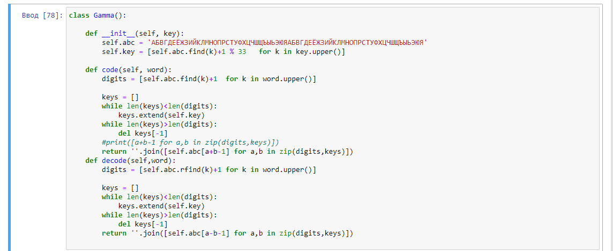
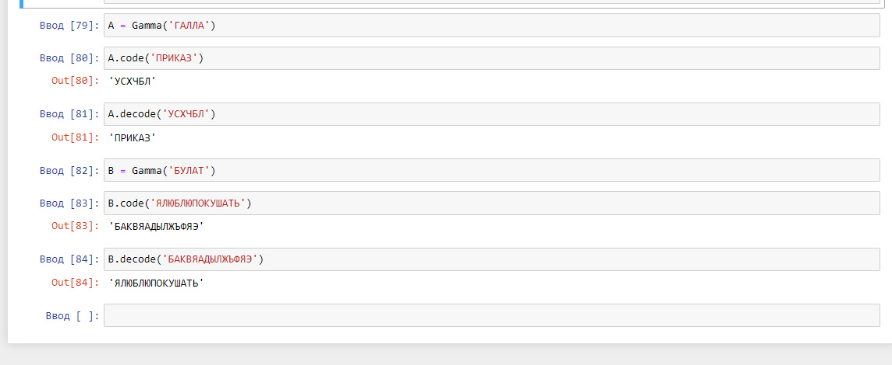

---
## Front matter
lang: ru-RU
title: Отчёт по лабораторной работе 3
author: 'Хамбалеев Булат Галимович'
date: 15 октября, 2022

## Formatting
toc: false
slide_level: 2
theme: metropolis
mainfont: Ubuntu
romanfont: Ubuntu
sansfont: Ubuntu
monofont: Ubuntu
header-includes: 
 - \metroset{progressbar=frametitle,sectionpage=progressbar,numbering=fraction}
 - '\makeatletter'
 - '\beamer@ignorenonframefalse'
 - '\makeatother'
aspectratio: 43
section-titles: true
---

## Цель работы

Реализовать алгоритм шифрования гаммированием конечной гаммой.

## Задание

Задание подразумевает реализацию алгоритма шифрования гаммированием коненой гаммой на языке программирования Python.

# Выполнение лабораторной работы

1. Реализуем класс Gamma шифрования гаммированием..(рис. 1)

{ #fig:001 width=70% }

---

2. Проверим работу алгоритма. (рис. 2)

{ #fig:002 width=70% }

---

## {.standout}

Спасибо за внимание
