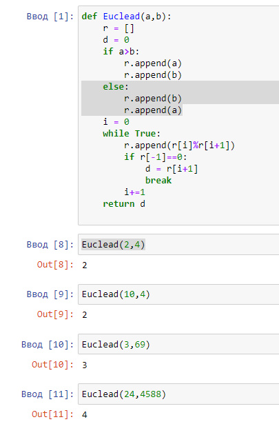
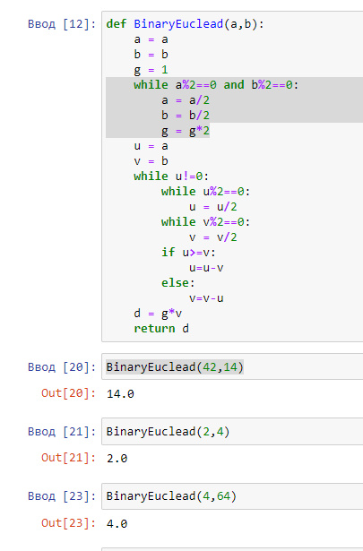
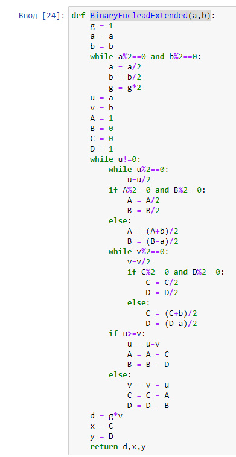
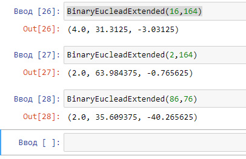

---
## Front matter
lang: ru-RU
title: Отчёт по лабораторной работе 4
author: 'Хамбалеев Булат Галимович'
date: 29 октября, 2022

## Formatting
toc: false
slide_level: 2
theme: metropolis
mainfont: Ubuntu
romanfont: Ubuntu
sansfont: Ubuntu
monofont: Ubuntu
header-includes: 
 - \metroset{progressbar=frametitle,sectionpage=progressbar,numbering=fraction}
 - '\makeatletter'
 - '\beamer@ignorenonframefalse'
 - '\makeatother'
aspectratio: 43
section-titles: true
---

## Цель работы

Реализовать алгоритмы нахождения наибольшего общего делителя.

## Задание

Задание подразумевает реализацию алгоритма нахождения наибольшего общего делителя на языке программирования Python.

# Выполнение лабораторной работы

1. Реализуем функцию алгоритма Евклида.

{ #fig:001 width=70% }

---

2. Реализуем бинарный алгоритм Евклида. 

{ #fig:002 width=70% }

---

3. Реализуем расширенный бинарный алгоритм Евклида. 

{ #fig:003 width=70% }

---

4. Проверим работу расширеного бинарного алгоритма. 

{ #fig:004 width=70% }

---

## {.standout}

Спасибо за внимание
