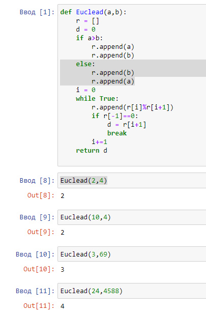
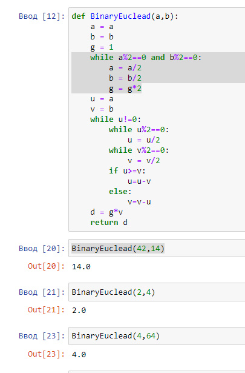
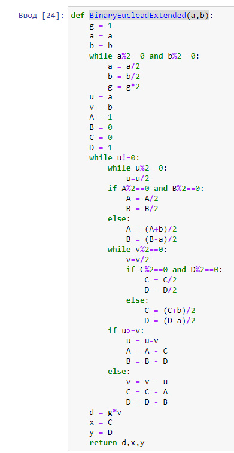
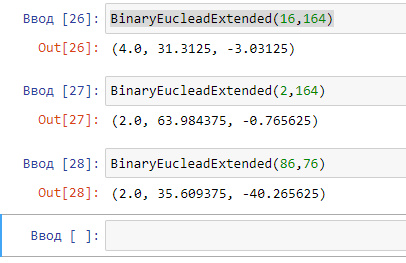

---
# Front matter
title: "Отчет по лабораторной работе номер 4"
author: "Хамбалеев Булат Галимович"

# Generic otions
lang: ru-RU
toc-title: "Содержание"

# Pdf output format
toc: true # Table of contents
toc_depth: 2
lof: true # List of figures
lot: true # List of tables
fontsize: 12pt
linestretch: 1.5
papersize: a4
documentclass: scrreprt
## I18n
polyglossia-lang:
  name: russian
  options:
	- spelling=modern
	- babelshorthands=true
polyglossia-otherlangs:
  name: english
### Fonts
mainfont: Ubuntu
romanfont: Ubuntu
sansfont: Ubuntu
monofont: Ubuntu
mainfontoptions: Ligatures=TeX
romanfontoptions: Ligatures=TeX
sansfontoptions: Ligatures=TeX,Scale=MatchLowercase
monofontoptions: Scale=MatchLowercase,Scale=0.9
## Biblatex
biblatex: true
biblio-style: "gost-numeric"
biblatexoptions:
  - parentracker=true
  - backend=biber
  - hyperref=auto
  - language=auto
  - autolang=other*
  - citestyle=gost-numeric
## Misc options
indent: true
header-includes:
  - \linepenalty=10 # the penalty added to the badness of each line within a paragraph (no associated penalty node) Increasing the value makes tex try to have fewer lines in the paragraph.
  - \interlinepenalty=0 # value of the penalty (node) added after each line of a paragraph.
  - \hyphenpenalty=50 # the penalty for line breaking at an automatically inserted hyphen
  - \exhyphenpenalty=50 # the penalty for line breaking at an explicit hyphen
  - \binoppenalty=700 # the penalty for breaking a line at a binary operator
  - \relpenalty=500 # the penalty for breaking a line at a relation
  - \clubpenalty=150 # extra penalty for breaking after first line of a paragraph
  - \widowpenalty=150 # extra penalty for breaking before last line of a paragraph
  - \displaywidowpenalty=50 # extra penalty for breaking before last line before a display math
  - \brokenpenalty=100 # extra penalty for page breaking after a hyphenated line
  - \predisplaypenalty=10000 # penalty for breaking before a display
  - \postdisplaypenalty=0 # penalty for breaking after a display
  - \floatingpenalty = 20000 # penalty for splitting an insertion (can only be split footnote in standard LaTeX)
  - \raggedbottom # or \flushbottom
  - \usepackage{float} # keep figures where there are in the text
  - \floatplacement{figure}{H} # keep figures where there are in the text
---

# Цель работы

Реализовать алгоритмы нахождения наибольшего общего делителя.

# Задание

Задание подразумевает реализацию алгоритма нахождения наибольшего общего делителя на языке программирования Python.

# Теория

Алгоритм Евклида это эффективный алгоритм для нахождения наибольшего общего делителя двух целых чисел. Алгоритм назван в честь греческого математика Евклида, который впервые описал его в VII и X книгах «Начал». Это один из старейших численных алгоритмов, используемых в наше время.

# Выполнение работы

1. Реализуем функцию алгоритма Евклида.(рис. 1)

{ #fig:001 width=90% }

2. Реализуем бинарный алгоритм Евклида. (рис. 2)

{ #fig:002 width=90% }

3. Реализуем расширенный бинарный алгоритм Евклида.

{ #fig:003 width=90% }

4. Проверим работу расширенного бинарного алгоритма.

{ #fig:004 width=90% }

# Библиография

1. ТУИС РУДН

2. https://ru.wikipedia.org/wiki/%D0%90%D0%BB%D0%B3%D0%BE%D1%80%D0%B8%D1%82%D0%BC_%D0%95%D0%B2%D0%BA%D0%BB%D0%B8%D0%B4%D0%B0

# Выводы

Во время выполнения лабораторной работы я на практике реализовал несколько версий алгоритма Евклида.