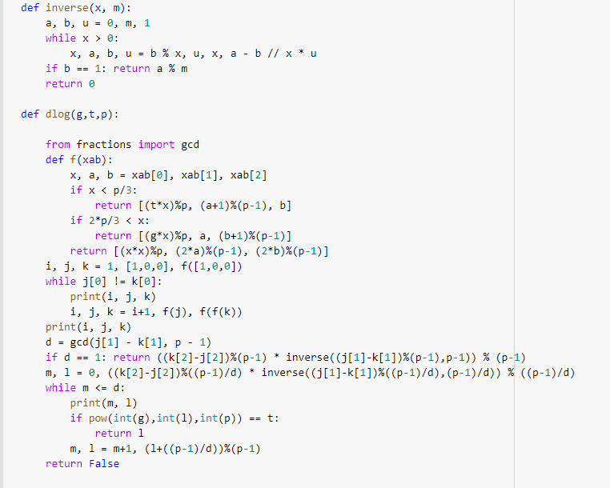
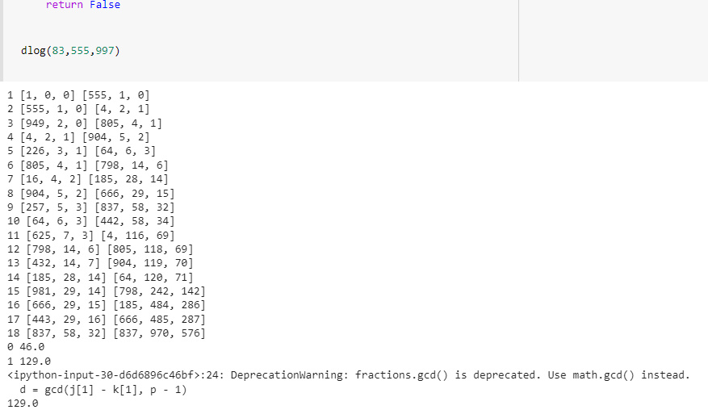

---
## Front matter
lang: ru-RU
title: Отчёт по лабораторной работе 7
author: 'Хамбалеев Булат Галимович'
date: 10 декабря, 2022

## Formatting
toc: false
slide_level: 2
theme: metropolis
mainfont: Ubuntu
romanfont: Ubuntu
sansfont: Ubuntu
monofont: Ubuntu
header-includes: 
 - \metroset{progressbar=frametitle,sectionpage=progressbar,numbering=fraction}
 - '\makeatletter'
 - '\beamer@ignorenonframefalse'
 - '\makeatother'
aspectratio: 43
section-titles: true
---

## Цель работы

Реализовать алгоритм p-метода Полларда для задач дискретного логарифмирования.

## Задание

Задание подразумевает реализацию алгоритма p-метода Полларда для задач дискретного логарифмирования.

# Выполнение лабораторной работы

1. Реализуем функцию алгоритма. 

{ #fig:001 width=70% }

---

2.  Проверим работу алгоритма.

{ #fig:002 width=70% }

## {.standout}

Спасибо за внимание
