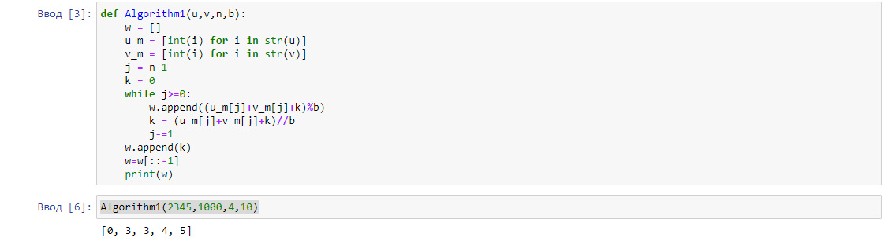
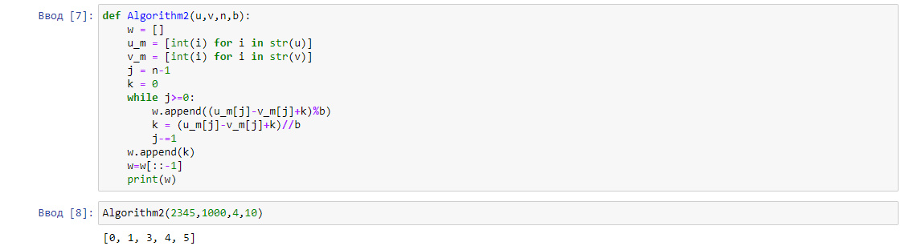
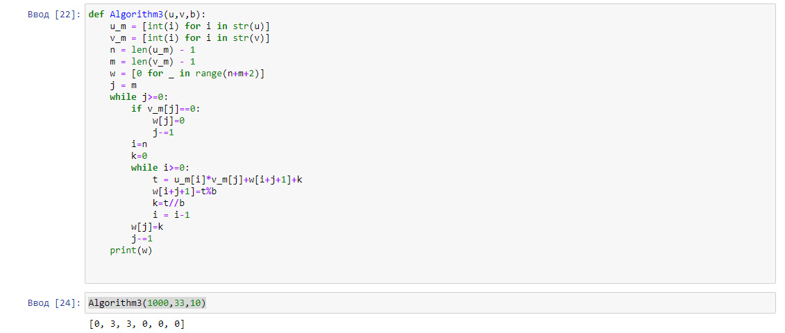
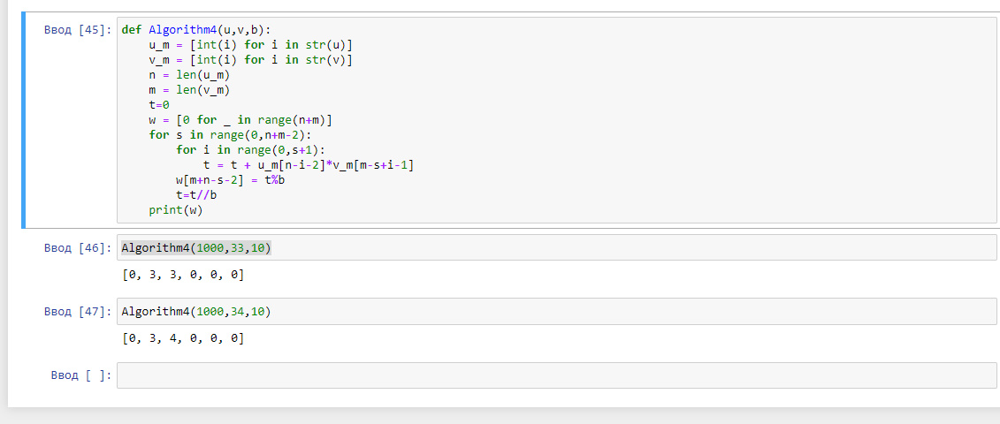

---
## Front matter
lang: ru-RU
title: Отчёт по лабораторной работе 8
author: 'Хамбалеев Булат Галимович'
date: 24 декабря, 2022

## Formatting
toc: false
slide_level: 2
theme: metropolis
mainfont: Ubuntu
romanfont: Ubuntu
sansfont: Ubuntu
monofont: Ubuntu
header-includes: 
 - \metroset{progressbar=frametitle,sectionpage=progressbar,numbering=fraction}
 - '\makeatletter'
 - '\beamer@ignorenonframefalse'
 - '\makeatother'
aspectratio: 43
section-titles: true
---

## Цель работы

Реализовать алгоритмы целочисленной арифметики многократной точности.

## Задание

Задание подразумевает реализацию алгоритмов.

# Выполнение лабораторной работы

1. Реализуем функцию алгоритма сложения. 

{ #fig:001 width=70% }

---

2.  Реализуем функцию алгоритма вычитания.

{ #fig:002 width=70% }

---

3.  Реализуем функцию алгоритма умножения.

{ #fig:003 width=70% }

---

4.  Реализуем функцию алгоритма быстрого столбика.(рис.4)

{ #fig:004 width=70% }

---

## {.standout}

Спасибо за внимание
